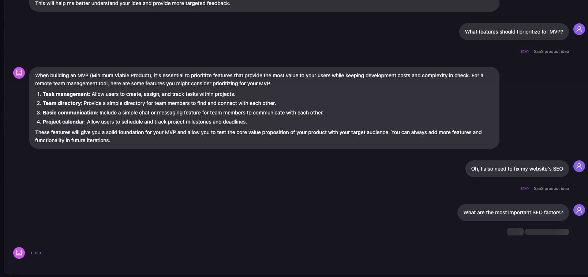

# DriftOS Architecture Documentation

## System Overview

DriftOS is a microservices-based platform for semantic conversation routing and management. The system consists of multiple services that work together to provide authenticated API access, conversation management, and LLM-powered features.

## Service Architecture

```
┌─────────────────┐
│  driftos-demo   │ (Frontend - React)
│  driftos-viz    │ (Visualization)
└────────┬────────┘
         │
         ▼
┌─────────────────────────────────────────┐
│         driftos-gateway                 │
│  ┌───────────────────────────────────┐  │
│  │  • Authentication (Clerk)         │  │
│  │  • API Key Management             │  │
│  │  • Rate Limiting (ALL ENDPOINTS)  │  │
│  │  • Usage Tracking & Logging       │  │
│  │  • Cost Calculation               │  │
│  └───────────────────────────────────┘  │
└──────────┬──────────────────────────────┘
           │
     ┌─────┴─────┐
     │           │
     ▼           ▼
┌─────────┐ ┌────────────────┐
│ driftos-│ │ driftos-embed- │
│  core   │ │   enterprise   │
│         │ │                │
│ • Drift │ │ • Drift        │
│ • Facts │ │ • Facts        │
│ • LLM   │ │ • LLM          │
│ • Demo  │ │ • Demo         │
└─────────┘ └────────────────┘
```

## Critical Architectural Principles

### 1. **Gateway-Only Rate Limiting**

**CRITICAL:** All rate limiting MUST be handled by `driftos-gateway`. Backend services (`driftos-core`, `driftos-embed-enterprise`) should NEVER implement their own rate limiting.

**Why:**
- Backend services are called through the gateway proxy
- Backend services see the gateway's IP, not the client's IP
- Double rate limiting causes incorrect behavior
- Gateway has access to user/API key context for proper rate limiting

**Implementation:**
- ✅ Gateway: `src/plugins/category-rate-limit.ts` - handles ALL rate limiting
- ❌ Backend: No rate limiting code in backend services

### 2. **Gateway-Only Usage Tracking & Cost Calculation**

All usage tracking, cost calculation, and logging happens in the gateway:

**Gateway Responsibilities:**
- Track all API requests (Management, Light Ops, Heavy Ops)
- Extract token usage from:
  - Response headers (`X-Token-Input`, `X-Token-Output`, `X-Token-Total`, `X-LLM-Model`)
  - SSE streams (`[TOKENS]` event)
- Calculate costs using model pricing
- Log to TimescaleDB (`api_request_logs` table)
- Aggregate for user dashboards and admin analytics

**Backend Responsibilities:**
- Set token usage headers on JSON responses
- Send `[TOKENS]` event in SSE streams
- Do NOT track usage themselves
- Do NOT calculate costs

### 3. **Demo Endpoints Architecture**

Demo endpoints allow unauthenticated users to try the system with IP-based rate limiting.

**Split Endpoint Pattern (NEW):**

```typescript
// Frontend flow:
1. POST /api/v1/llm/demo/route
   → Returns: JSON with drift state + token headers
   → Gateway logs routing + fact extraction costs

2. POST /api/v1/llm/demo/chat
   → Returns: SSE stream with LLM response
   → Sends [TOKENS] event at end
   → Gateway logs LLM generation costs
```

**Why Split:**
- Separate cost tracking for routing vs generation
- Enables proper analytics and pricing predictions
- Matches authenticated API flow

**Demo Endpoints:**
- `/api/v1/llm/demo/route` - Drift routing with fact extraction (JSON + headers)
- `/api/v1/llm/demo/chat` - LLM streaming (SSE + [TOKENS] event)
- `/api/v1/llm/demo/stream` - Simple streaming (backward compatibility)
- Same endpoints exist on `/api/v1/embed/*`

**Demo Rate Limiting:**
- Handled by gateway only
- 100 requests/minute per IP (default)
- Tracked as `demo:${IP_ADDRESS}` in logs

### 4. **SSE Token Tracking**

Streaming responses require special handling for token tracking:

**Problem:**
- Gateway's `onResponse` hook fires when stream **starts**, not when it **completes**
- Token usage arrives in `[TOKENS]` event at **end** of stream
- Can't log tokens that haven't arrived yet

**Solution:**
- Set `skipAutoLogging` flag on streaming responses
- Parse SSE stream for `[TOKENS]` event
- Call `logUsageManually()` after stream completes
- Log includes all token data extracted from stream

**Implementation:**
```typescript
// Gateway proxy (llm/index.ts, embed/index.ts)
if (contentType?.includes('text/event-stream')) {
  request.usageMetadata.skipAutoLogging = true;

  // Parse stream for [TOKENS] event
  for (const line of lines) {
    if (line.startsWith('data: [TOKENS]')) {
      const tokensData = JSON.parse(line.slice(14));
      request.tokenUsage = {
        input: tokensData.inputTokens,
        output: tokensData.outputTokens,
        total: tokensData.totalTokens,
      };
      request.llmModel = tokensData.model;
    }
  }

  // Log after stream completes
  if (done) {
    request.logUsageManually?.(response.status);
    reply.raw.end();
  }
}
```

## Service Details

### driftos-gateway

**Purpose:** Central API gateway handling auth, rate limiting, and proxying

**Key Files:**
- `src/plugins/auth.ts` - Clerk authentication, API key validation
- `src/plugins/monthly-quota.ts` - Monthly quota enforcement (Heavy Ops only)
- `src/plugins/category-rate-limit.ts` - Tiered per-minute rate limiting
- `src/plugins/usage-tracking-v2.ts` - TimescaleDB logging
- `src/routes/llm/index.ts` - Proxy to driftos-core
- `src/routes/embed/index.ts` - Proxy to driftos-embed-enterprise
- `src/utils/endpoint-categories.ts` - Heavy/Light/Management categorization
- `src/utils/model-pricing.ts` - Cost calculation

**Environment:**
- `PORT=3000`
- `LLM_SERVICE_URL` - driftos-core URL
- `EMBED_SERVICE_URL` - driftos-embed-enterprise URL
- `DATABASE_URL` - PostgreSQL with TimescaleDB

**Public Routes:**
- `/health`, `/documentation`, `/metrics`
- `/api/v1/llm/demo/*` - Demo endpoints
- `/api/v1/embed/demo/*` - Demo endpoints

### driftos-core

**Purpose:** Core LLM and drift routing service

**Key Files:**
- `src/services/drift/orchestrator.ts` - Main drift orchestration
- `src/services/drift/operations/classify-route/index.ts` - Routing classification
- `src/services/drift/operations/execute-route.ts` - Branch creation/routing
- `src/services/facts/index.ts` - Fact extraction
- `src/routes/demo/index.ts` - Demo endpoints (no rate limiting!)
- `src/routes/drift/index.ts` - Authenticated drift API

**Environment:**
- `PORT=3001`
- `DATABASE_URL` - PostgreSQL
- `OPENAI_API_KEY` - For LLM calls
- `DEMO_MODEL=llama-3.1-8b-instant` - Groq model for demo

**Note:** Assistant messages auto-STAY in current branch (no LLM call needed for routing)

### driftos-embed-enterprise

**Purpose:** Embedded conversation service with drift routing

**Key Files:**
- Similar structure to driftos-core
- `src/routes/demo/index.ts` - Demo endpoints (no rate limiting!)

**Environment:**
- `PORT=3002`
- Same env vars as driftos-core

## Data Flow Examples

### 1. Authenticated User Message

```
User → Gateway → Core/Embed
  1. Gateway: Validate API key/JWT
  2. Gateway: Check rate limit
  3. Gateway: Proxy to backend with x-user-id header
  4. Backend: Process drift routing
  5. Backend: Set X-Token-* headers
  6. Gateway: Extract tokens from headers
  7. Gateway: Calculate cost
  8. Gateway: Log to api_request_logs
  9. User: Receives response
```

### 2. Demo Mode Message

```
User → Gateway → Core/Embed (split flow)

  Step 1 - Routing:
  1. POST /api/v1/llm/demo/route
  2. Gateway: Check rate limit (demo:IP)
  3. Backend: Process drift + extract facts
  4. Backend: Set X-Token-* headers
  5. Gateway: Extract tokens, log routing cost

  Step 2 - LLM:
  1. POST /api/v1/llm/demo/chat
  2. Gateway: Check rate limit (demo:IP)
  3. Backend: Stream LLM response
  4. Backend: Send [TOKENS] event at end
  5. Gateway: Parse [TOKENS], log LLM cost
```

### 3. SSE Streaming Response

```
1. Backend: Streams LLM response as SSE
2. Gateway: Sets skipAutoLogging=true
3. Gateway: Pipes stream to client
4. Gateway: Parses each SSE chunk for [TOKENS]
5. Backend: Sends final [TOKENS] event
6. Gateway: Extracts token data
7. Gateway: Calls logUsageManually()
8. Gateway: Writes log with tokens
```

## Database Schema

### api_request_logs (TimescaleDB Hypertable)

```sql
CREATE TABLE api_request_logs (
  timestamp TIMESTAMPTZ NOT NULL,
  api_key_id TEXT NOT NULL,
  user_id TEXT NOT NULL,
  endpoint TEXT NOT NULL,
  method TEXT NOT NULL,
  status_code INTEGER NOT NULL,
  category TEXT NOT NULL,  -- 'heavy', 'light', 'management'
  input_tokens INTEGER NOT NULL,
  output_tokens INTEGER NOT NULL,
  total_tokens INTEGER NOT NULL,
  cost_usd DECIMAL(10,6) NOT NULL,
  model TEXT,
  response_time_ms INTEGER NOT NULL
);

-- Partitioned by time for efficient queries
-- Continuous aggregates for dashboard
```

### Endpoint Categories

**Heavy Ops** (count toward quota, tracked for billing):
- `/api/v1/llm/drift/process`
- `/api/v1/llm/facts/:id/extract`
- `/api/v1/llm/llm/chat/stream`
- `/api/v1/llm/demo/route`
- `/api/v1/llm/demo/chat`
- `/api/v1/embed/*` equivalents

**Light Ops** (CRUD, don't count toward quota):
- `/api/v1/llm/conversations/*`
- `/api/v1/llm/branches/*`
- `/api/v1/llm/messages/*`
- `/api/v1/llm/facts/*` (read)

**Management** (account operations):
- `/api/v1/keys/*`
- `/api/v1/usage/*`
- `/api/v1/tiers/*`

## Configuration

### Rate Limits (Gateway)

**Per-Minute Rate Limits:**
```typescript
// Per-tier limits (requests per minute)
{
  free: {
    heavy: 100,
    light: 1000,
    management: 1000,
  },
  pro: {
    heavy: 1000,
    light: 10000,
    management: 10000,
  },
  enterprise: {
    heavy: 10000,
    light: 100000,
    management: 100000,
  },
}

// Demo (unauthenticated): 100 requests/minute per IP
```

**Monthly Quotas:**
```typescript
// Enforced for Heavy Ops only (Light Ops and Management don't count)
{
  free: {
    monthlyRequests: <configured in database>,
    tokensPerMonth: <configured in database>,
  },
  pro: {
    monthlyRequests: <configured in database>,
    tokensPerMonth: <configured in database>,
  },
  enterprise: {
    monthlyRequests: null, // Unlimited
    tokensPerMonth: null,  // Unlimited
  },
}
```

**Quota Enforcement Flow:**
1. `monthly-quota` plugin checks Heavy Ops requests
2. Queries `api_request_logs` for current month usage
3. Compares to tier's `monthlyRequests` limit
4. Returns 429 if exceeded with reset date
5. Demo endpoints (unauthenticated) have no monthly quota

### Model Pricing

```typescript
// src/utils/model-pricing.ts
{
  'llama-3.1-8b-instant': {
    inputCostPer1M: 0.05,
    outputCostPer1M: 0.08,
  },
  'gpt-4o': {
    inputCostPer1M: 2.50,
    outputCostPer1M: 10.00,
  },
}
```

## Common Issues & Solutions

### Issue: Missing tokens in logs

**Symptoms:** Logs show `-` for tokens, model, cost

**Causes:**
1. Backend didn't set `X-Token-*` headers
2. SSE stream didn't send `[TOKENS]` event
3. Gateway parsed stream before `[TOKENS]` arrived

**Solution:**
- Check backend is setting headers/events
- Verify `skipAutoLogging` + `logUsageManually` for SSE

### Issue: Demo rate limiting too aggressive

**Symptoms:** 429 errors in demo mode

**Causes:**
1. Backend has its own rate limiting (WRONG!)
2. Gateway demo limit too low
3. Split endpoints double-counting

**Solution:**
- Remove ALL rate limiting from backend services
- Increase `DEMO_RATE_LIMIT` in gateway if needed
- Each API call counts separately (expected)

### Issue: Double rate limiting

**Symptoms:** Hit rate limits much faster than expected

**Cause:** Backend services have rate limiting code (WRONG!)

**Solution:**
- Delete ALL rate limiting code from:
  - `driftos-core/src/routes/demo/*`
  - `driftos-embed-enterprise/src/routes/demo/*`
- Only gateway should rate limit

## Development Workflow

### Running Services Locally

```bash
# Gateway (port 3000)
cd driftos-gateway
npm run dev

# Core (port 3001)
cd driftos-core
npm run dev

# Embed Enterprise (port 3002)
cd driftos-embed-enterprise
npm run dev

# Frontend (port 5173)
cd driftos-demo
npm run dev
```

### Testing Demo Mode

```bash
# Test routing
curl -X POST http://localhost:3000/api/v1/llm/demo/route \
  -H "Content-Type: application/json" \
  -d '{"messages":[{"role":"user","content":"Hello"}]}'

# Test chat streaming
curl -X POST http://localhost:3000/api/v1/llm/demo/chat \
  -H "Content-Type: application/json" \
  -d '{"messages":[{"role":"user","content":"Hello"}]}'
```

### Checking Logs

```bash
# Gateway logs show token extraction
docker logs -f driftos-gateway-1 | grep "Extracted tokens"

# Check admin dashboard
http://localhost:3000/api/v1/admin/logs
```

## Production Deployment

### Environment Variables

**Gateway:**
```
NODE_ENV=production
PORT=3000
LLM_SERVICE_URL=http://driftos-core:3001
EMBED_SERVICE_URL=http://driftos-embed-enterprise:3002
DATABASE_URL=postgresql://...
CLERK_SECRET_KEY=...
```

**Backend Services:**
```
NODE_ENV=production
PORT=3001/3002
DATABASE_URL=postgresql://...
OPENAI_API_KEY=...
DEMO_MODEL=llama-3.1-8b-instant
DEMO_RATE_LIMIT=100  # Not used! Gateway handles this
```

### Health Checks

- Gateway: `GET /health`
- Core: `GET /api/v1/health`
- Embed: `GET /api/v1/health`

## Key Takeaways for AI Assistants

1. **Never add rate limiting to backend services** - only gateway
2. **Demo endpoints don't authenticate** - tracked by IP
3. **SSE streams need manual logging** - parse [TOKENS] event
4. **Split demo endpoints** - separate routing and chat costs
5. **Assistant messages don't call LLM for routing** - auto-STAY
6. **Gateway sees all traffic** - perfect place for tracking/limiting
7. **Backend services are stateless** - no user context needed
8. **Costs calculated in gateway** - using model pricing table
9. **TimescaleDB for time-series logs** - efficient querying
10. **All authentication in gateway** - backends trust x-user-id header

## Document Metadata

- **Last Updated:** 2026-01-18
- **Author:** System Architecture Team
- **Version:** 2.0 (Post-Demo Split Refactor)
- **Related Docs:**
  - `/CLERK_IMPLEMENTATION.md` - Authentication details
  - `/STRIPE_IMPLEMENTATION.md` - Billing integration
  - `/WEBHOOK_TESTING_GUIDE.md` - Testing webhooks
